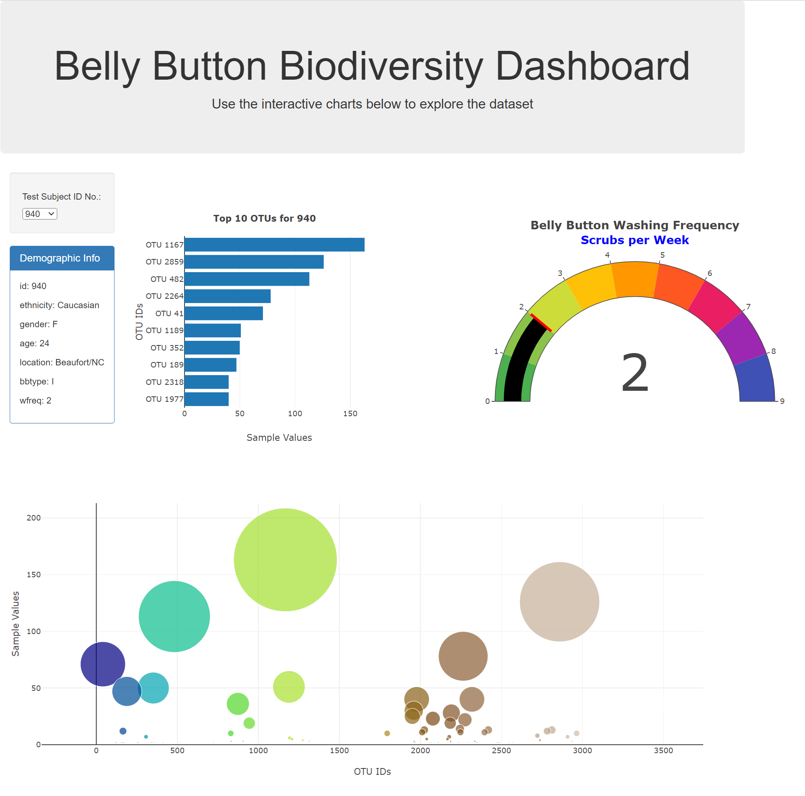
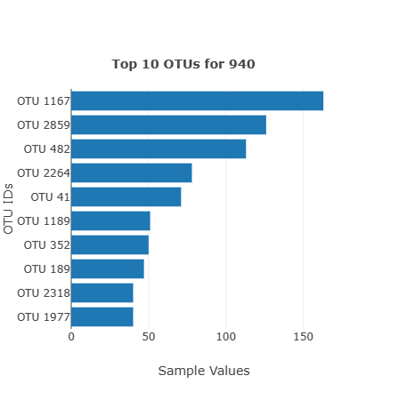
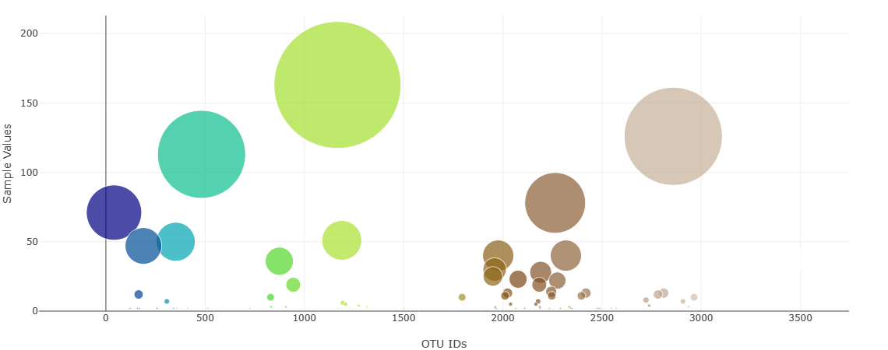
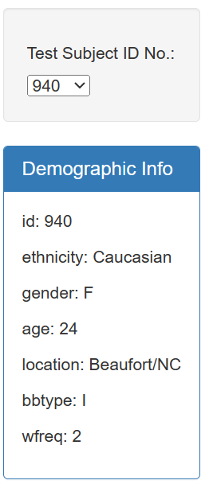
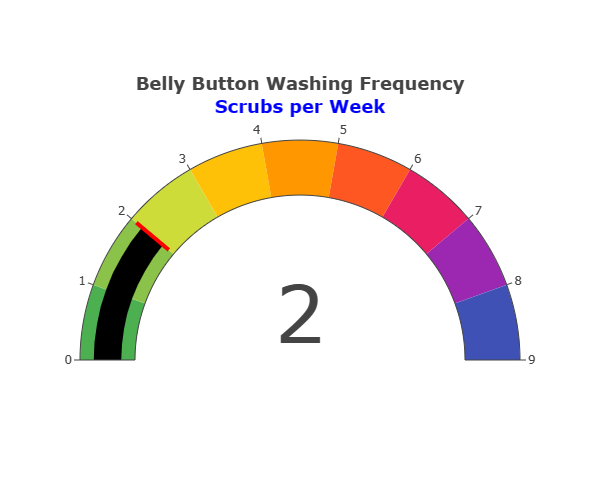

# Topic: Belly Button Biodiversity Dashboard

## Table of Contents
- [Overview](#overview)
- [Technologies Used](#technologies-used)
- [How to Run the Application](#how-to-run-the-application)
- [Data Source](#data-source)
- [Folder Structure](#folder-structure)
- [Instructions](#instructions)
- [Functionality](#functionality)
- [Advanced Challenge (Optional)](#advanced-challenge-optional)
- [Deployment](#deployment)
- [Solution Location](#solution-location)
- [Acknowledgments](#acknowledgments)
- [Author](#author)
- [License](#license)

## Overview
This interactive dashboard explores the Belly Button Biodiversity dataset, cataloguing the microbes that colonize human navels. The application includes a horizontal bar chart, a bubble chart, and a gauge chart displaying various aspects of the dataset.

## Technologies Used
- D3.js
- Plotly
- HTML
- CSS (Bootstrap)

## How to Run the Application
1. Clone the repository to your local machine.
2. Open the `index.html` file in a web browser.

## Data Source
The data is fetched from the [Belly Button Biodiversity Dataset](http://robdunnlab.com/projects/belly-button-biodiversity/).

## Folder Structure
- **index.html:** Main HTML file for the dashboard.
- **static/:** Folder containing static assets (JavaScript, .gitkeep).
  - **js/:** JavaScript files (`app.js` for main functionality).
  - **data/:** Data files (e.g., `samples.json`).

## Instructions

### Use the D3 library to read in samples.json from the URL

### javascript
// Sample code to read samples.json using D3
const url = 'https://2u-data-curriculum-team.s3.amazonaws.com/dataviz-classroom/v1.1/14-Interactive-Web-Visualizations/02-Homework/samples.json';

### Create a promise for the sample data
### Code for creating the horizontal bar chart
### Use sample_values as values for the bar chart.
### Use otu_ids as labels for the bar chart.
### Use otu_labels as hovertext for the chart.
### Code for creating the bubble chart
### Use otu_ids for x values.
### Use sample_values for y values.
### Use sample_values for marker size.
### Use otu_ids for marker colors.
### Use otu_labels for text values.
### Code for displaying sample metadata
### Display an individual's demographic information.
### Display each key-value pair from the metadata JSON object on the page.
### Code for updating all plots when a new sample is selected

## Functionality

- **Bar Chart:** Displays the top 10 OTUs for the selected individual.
  
  
- **Bubble Chart:** Visualizes each sample's OTU data.
  
  
- **Test Subject ID and MetaData:**
   
   
- **Gauge Chart:** Displays the washing frequency of the selected individual.
 

## Advanced Challenge (Optional)
- An adapted Gauge Chart from [Plotly](https://plotly.com/javascript/gauge-charts/) is used to plot the weekly washing frequency of the individual.

## App Deployment
= The application is deployed on [GitHub Pages](https://anyasorg.github.io/belly-button-challenge/).

## Challenge Solution Location
- The solutions to the specified questions are in app.js.

## Acknowledgments
- Dataset: [Belly Button Biodiversity Dataset](http://robdunnlab.com/projects/belly-button-biodiversity/).

## Author
- [Godswill Anyasor](https://github.com/AnyasorG)

## License
- This project is open-source and is made available under the terms of the MIT License. For the full details of the MIT License, please refer to [MIT License Details](https://choosealicense.com/licenses/mit/).
